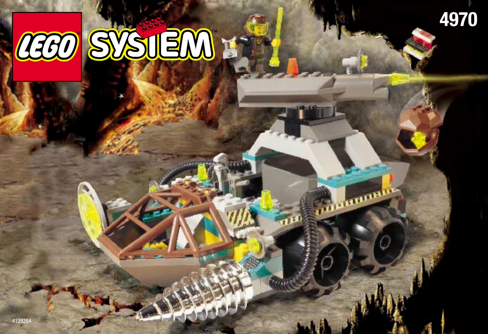
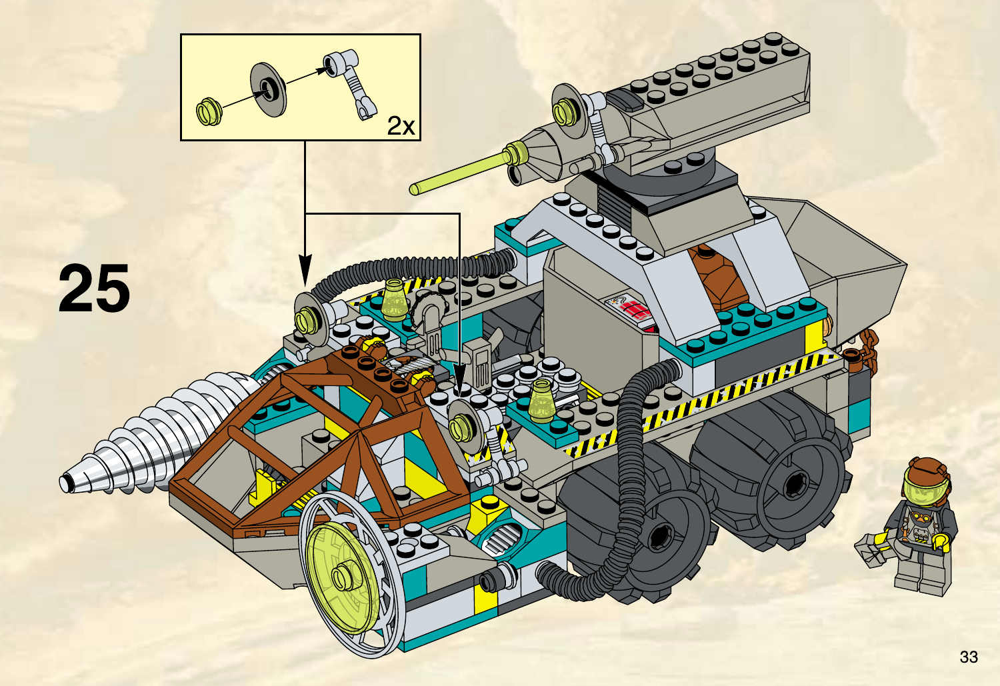

# 07 · Chrome Crusher — T083 accepted design package

**unit.rock_raiders.chrome_crusher · Large · OFFICIAL-ADAPTED**

**Статус:** директор прийняв цей Production Design Target 2026-09-24. T084 авторизовано для цього юніта, але не розпочато; це дизайн-пакет, не виробнича модель. T082 прийнято як основу.

## Production Design Target · SOURCE_LOCKED

Завершений офіційний LEGO 4970: довге відкрите шасі, чотири величезні колеса, передня операторська клітка, винесений убік бур із видимим приводом, центральний силовий блок, відкрита вантажна зона та піднята робоча балка. Зберегти асиметрію, силует, джерельні кольори й пропорції; не перетворювати на закритий танк.

PRODUCTION DESIGN TARGET · SOURCE_LOCKED: завершений офіційний LEGO 4970 з усіма джерельними пропорціями й деталями. Єдина прийнята видима ігрова дельта — мала командна мітка на зовнішній боковині центральної рами; решта геометрії/кольору лишається як на цій офіційній сторінці.

## Source Evidence

Official LEGO/source imagery below defines the original object; generated proposals are not source evidence.

SOURCE EVIDENCE: офіційна інструкція LEGO 4970, сторінка 33; показує збірку балки/бура та їхні вузли. Це доказ конструкції, не окремий вигляд моделі й не схема для домислювання прихованих з’єднань.

## Пропорції та масштаб

Кабіна того самого сімейства й масштабу оператора, що у Dozer/Grinder. Машина довша й масивніша завдяки рамі та колесам, не завдяки збільшеній людині. Large — незмінна авторитетна площа. Масштабовані самі шини й винесений бур не приховують чотириколісну схему.

## Конструкція

Зберегти офіційну довгу розгалужену раму, чотири окремі колісні модулі, передню операторську клітку, відкриту середню/задню службову зону, механічний привод винесеного бура та верхню робочу балку. Не домальовувати невидимий задній маршрут кабелів як доведений факт.

## Прийнята ігрова адаптація

Єдина запропонована видима ігрова відмінність: мала пласка командна мітка на зовнішній боковині центральної рами над задньою парою коліс, у зоні збереження великої джерельної деталі. Не змінювати бур, балку, вантажне оснащення чи силует. Ігрову роль показує контактний бур; балка не отримує нової зброї чи снаряда.

## Командна позначка

Одна мала пласка командна мітка на зовнішній боковині центральної рами над задньою парою коліс. Не дублювати її на робочій балці чи лампі.

## Кольори й матеріали

Велика світло-сіра рама і чорні колеса/кабелі; коричнева кабіна, бірюзові горизонтальні вставки, жовті небезпечні кромки. Хром — на бурі. Печатні решітки не замінюють отвори й не стають світловими панелями.

## Ракурси

- Спереду: окремо читаються кабіна й винесений убік від її осі бур; не вирівнювати їх в один симетричний ніс.
- Збоку: довгий відкритий міст над двома великими колесами, зверху окрема робоча балка.
- Зверху: силові шланги й відкритий вантажний/службовий простір, без суцільної бронекришки.
- Ззаду: джерельне покриття часткове; не вигадувати точне прокладання кабелів чи зазори вантажу.

Це словесні вимоги до ракурсів завершеного дизайну, не заявка на наявність нових ортографічних зображень. Підтверджене покриття й прогалини джерел перелічені нижче.

## Стани

| Стан | Видимий результат |
|---|---|
| Спокій / рух | Малі коливання приводу, видиме обертання чотирьох коліс; важка інерція без ковзання танка. |
| Контактна атака | Корпус осідає до інструмента, бур обертається на джерельній осі; контактні ефекти тільки біля наконечника. |
| Службове світло | Верхня балка спрямовує наявне робоче світло; жодного нового снаряда чи лазерної атаки. |
| Пошкодження / знищення | Гасне другорядна лампа, вібрує привід; після загибелі відділяються бур, балка й колесо, оголюючи довгу раму. |

Усі рухи лише відображають стан симуляції. Немає нових команд, потужності, місткості чи таймінгів. Виробництво, brownout та окремий construction-progress стан не додаються юніту за аналогією з будівлею; поява/ремонт використовують чинні події.

## Геометрія, текстури й віддалення

- Геометрія: open forked chassis.
- Геометрія: four huge wheels.
- Геометрія: drill motor path and helix.
- Геометрія: raised beam and cargo deck.

Close: зберігає джерельні головні деталі, кріплення й оператора. Combat: ті самі великі маси й контакти, менше дрібних швів/зубців. Strategic: зберігає форму основи, інструмента та стану; без мікродеталей. Числовий бюджет призначається після прийняття дизайну; перевірка реальною камерою й LOD — T084.

- `rr_heavy_frame_surface`: 2048x2048; Tangent-space normal plus linear roughness; body color remains a material parameter. Shared model-space field, 4 m repeat; no per-part phase reset. Half strength at Combat; disabled at Strategic in favor of master-material roughness.
- `rr_tool_wear`: 1024x1024; Linear wear mask, tangent-space normal and roughness variation; no baked highlights. Non-tiling trim/atlas regions aligned to the mechanical wear direction. Normal and fine mask removed at Strategic; Tool material and silhouette remain.
- `rr_hazard_and_service_decals`: 1024x1024; sRGB RGBA decal atlas; alpha is coverage, never shadowing. Atlas placement only; stripes may repeat along authored straight runs without stretching. Keep only broad hazard bands at Combat; remove text and micro-labels at Strategic.
- `rr_console_and_signal_atlas`: 512x512; sRGB color/alpha plus separate linear emission mask; transparent polymer is not automatically emissive. Non-tiling atlas with stable panel IDs. Replace screens with one bounded Signal or Lamp color block at Strategic.

Усі текстури тут SPECIFIED_NOT_AUTHORED. Схвалені M7 матеріали залишаються основою; фотографії джерел і generated-концепти не є ігровими текстурами. Нові маски/декалі — майбутня робота проєкту з окремим оглядом. Не переносити текстурою отвори, опорні вузли або тіні.

## Механіка, точки прив’язки, LOD

[Іменовані опори та точки T082](../../M85SuperScout/Packets/unit_rock_raiders_chrome_crusher.md#f-state-and-animation-contract) — початкова схема, з такими уточненнями T083:

Four wheel pivots at their own axles. DrillSpin follows the source off-centre drill, not the vehicle midline. ToolBeam keeps its visible mount. Cargo socket stays inside the open service deck; no new ranged-weapon muzzle.

Existing socket inventory: `Socket_Selection`, `Socket_Health`, `Socket_DrillContact`, `Socket_DrillDust`, `Socket_DrillSparks`, `Socket_LampWork`, `Socket_Cargo`, `Socket_AudioEngine`, `Socket_AudioDrill`. No runtime binding is changed by this document. Exact clearance and animation arcs remain T084/T087 verification, not a request for a pre-model camera gate.

## Підтверджене, адаптоване, невідоме

Похідність і SHA-256 двох використаних офіційних сторінок зафіксовані в [unit-specific source evidence manifest](chrome_crusher_source_evidence.json).

| Source | Primary evidence | Inventory / archival check | Confidence | Intended use |
|---|---|---|---|---|
| 4970 — The Chrome Crusher | [LEGO instructions](https://www.lego.com/en-us/service/building-instructions/4970) [official PDF 1](https://www.lego.com/cdn/product-assets/product.bi.core.pdf/4129264.pdf) | [inventory](https://www.bricklink.com/catalogItemInv.asp?S=4970-1) | PRIMARY_VERIFIED | heavy wheeled drill, light and cargo machinery |

### Source audit [RockRaiders:4970]

- Evidence state: `OFFICIAL_PDF_VISUALLY_AUDITED`
- Evidence links: [official instruction PDF 1](https://www.lego.com/cdn/product-assets/product.bi.core.pdf/4129264.pdf)
- Construction map:
  - Evidence pages 2-11: Long forked chassis and independently built front control side modules.
  - Evidence pages 12-26: Motor block, raised frame, cockpit cage, cargo deck and flexible power/tool routing.
  - Evidence pages 27-33: Overhead tool/light beam, drill subassembly, wheel/light modules and final machine assembly.
  - Evidence pages 34-36: Drill motor operation/safety evidence and final mechanism instructions.
- View/mechanism coverage: front=VERIFIED p1 and p29-34; rear=PARTIAL p21-26; leftRight=VERIFIED p2-34 construction sequence; top=VERIFIED p2-33; threeQuarter=VERIFIED p1 and p29-33; undersideInterior=VERIFIED p2-20 chassis and motor build; mechanism=VERIFIED p27-36 drill drive, wheel modules and movable tool/light assembly
- Verified findings:
  - The vehicle is a long open industrial chassis wrapped around motor, cargo and tool systems rather than a solid armored hull.
  - The powered drill projects far beyond the front cage and is mechanically connected to the internal motor.
  - Four huge wheels are separate side modules; the raised work-light/tool beam forms a second skyline above the drill.
- Remaining evidence gaps:
  - A strict orthogonal rear photograph remains desirable for final cargo and cable clearance.

Any `PARTIAL` or `MISSING` view remains an explicit gap. One flattering three-quarter image is never sufficient.

**Source-decomposition rule:** A source set is a container of models, figures, equipment and detachable modules, not an automatic one-to-one unit mapping. Any composed design must disclose its exact donor components, adaptation and rejected alternatives before director approval.

- [4970-page01.png](References/4970-page01.png) — [OFFICIAL_INSTRUCTION_PAGE](https://www.lego.com/cdn/product-assets/product.bi.core.pdf/4129264.pdf)
- [4970-page33.png](References/4970-page33.png) — [OFFICIAL_INSTRUCTION_PAGE](https://www.lego.com/cdn/product-assets/product.bi.core.pdf/4129264.pdf)

**Невідоме / межа доказу:** Офіційний набір добре визначає цільовий зовнішній вигляд. Задній ортогональний вид, точне прокладання кабелів/зазори вантажної зони та рух підвіски лишаються прогалинами доказу й виробничими перевірками T084/T087; їх не домислювати в цьому дизайні. Матеріал хрому й читабельність малої командної мітки перевірити на моделі.

The T082 source packet remains immutable research history; this accepted T083 design supersedes only its explicitly identified design/motion suggestions. Source facts not reviewed here retain their stated confidence. No generated image proves hidden attachment geometry.

## Рішення режисера

**ПРИЙНЯТО 2026-09-24:** офіційний LEGO 4970 як Production Design Target у режимі SOURCE_LOCKED та одна мала пласка командна мітка на зовнішній боковині центральної рами над задньою парою коліс. Іншої видимої геометричної або кольорової адаптації немає. Бур і верхня балка лишаються джерельними; нової зброї немає.

**BLOCKING_LATER:** реальна геометрія, зазори, матеріали, камера/LOD і прив’язка анімації перевіряються у відповідних production gates. **DIAGNOSTIC:** порівняння з сусідніми юнітами; не повторювати прийнятий T082 blind review без конкретного дефекту.
