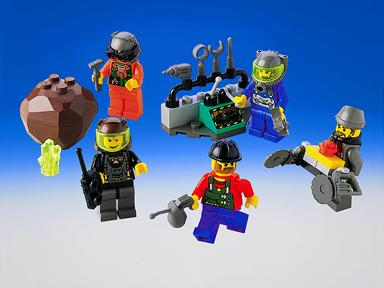

# 01 · Rock Raider Crew — T083 design proposal

**unit.rock_raiders.crew · Tiny · OFFICIAL-ADAPTED**

**Статус:** `DESIGN_ACCEPTED_T084_AUTHORIZED`; чинне попереднє затвердження директора збережено. Це не модель; T084 залишається незапущеним.

## Production Design Target · SOURCE_LOCKED

П’ять впізнаваних персонажів 4930 — Axle, Bandit, Docs, Jet і Sparks — з власним одягом та головними уборами. Один клас робітника; головний функціональний акцент — переносний інструмент. Завершена зовнішність береться з фотографії набору, без уніфікованого скафандра чи доданої броні.

Архівне фото завершеного 4930: п’ять джерельних персонажів. Авторство фотографії / ліцензія не встановлені; лише референс.

## Source Evidence

Official LEGO/source imagery below defines the original object; generated proposals are not source evidence.

## Пропорції та масштаб

Одна стандартна мініфігурка є масштабною одиницею партії. Голова, кисті та посадка всіх операторів машин мають той самий розмір. Великий ручний інструмент 4930 не збільшуємо понад його видимі пропорції на фото.

## Конструкція

Спільні торс, таз і короткі ноги з типовими LEGO-з’єднаннями. Голова, головний убір і руки з інструментом — окремі рухомі вузли. Підставка для інструментів і камінь із 4930 не приєднуються до тіла.

## Запропонована адаптація

Пропозиція: всі п’ять зовнішностей рівноправні, без прив’язування спеціальності або характеристик до персонажа. Інструмент змінюється відповідно до вже наявної роботи: видобуток, будівництво, ремонт. Постійного нового ранця не додаємо; індивідуальне спорядження з фото зберігаємо. Невідомі задні принти замінюємо чистим кольором як відкрито позначене спрощення.

## Командна позначка

Невелика плоска командна мітка на зовнішній поверхні плеча; не фарбувати весь шолом чи торс у колір гравця. Для ракурсів зверху — та сама мітка на верхній частині плеча, без нової геометрії ранця.

## Кольори й матеріали

Зберегти п’ять кольорових образів 4930, а не перефарбовувати людей у бірюзовий колір техніки. Жовті обличчя й кисті, вихідні кепка/шоломи/візори. Прозорий візор не світиться.

## Ракурси

- Спереду: обличчя, характерний одяг, інструмент збоку від торса.
- Збоку: звичайні пропорції мініфігурки; інструмент не перекриває обидві ноги.
- Ззаду: спокійна поверхня базового кольору одягу; не вигадувати невідомий принт.
- Зверху: головний убір залишається найбільшою формою; нічого схожого на важкий бойовий ранець.

Це словесні вимоги до ракурсів завершеного дизайну, не заявка на наявність нових ортографічних зображень. Підтверджене покриття й прогалини джерел перелічені нижче.

## Стани

| Стан | Видимий результат |
|---|---|
| Спокій / рух | Інструмент опущений збоку; невеликі рухи рук і короткі кроки, без військової стійки. |
| Робота / ремонт / будівництво | Обидві стопи стоять; інструмент доходить до видимого контакту, повторює короткий робочий цикл і повертається у переносне положення. Немає нової спеціальності персонажа. |
| Контактна самооборона | Наявний інструмент, без появи рушниці; рух слідує авторитетній події удару. |
| Пошкодження / загибель | Переривання робочої пози; інструмент відділяється перед коротким LEGO-розпадом після втрати юнітом функції. Без натуралістичних травм. |

Усі рухи лише відображають стан симуляції. Немає нових команд, потужності, місткості чи таймінгів. Виробництво, brownout та окремий construction-progress стан не додаються юніту за аналогією з будівлею; поява/ремонт використовують чинні події.

## Геометрія, текстури й віддалення

- Геометрія: five source-specific headwear profiles.
- Геометрія: minifigure hands, feet and body proportions.
- Геометрія: portable tool outline; no mandatory invented backpack.

Close: зберігає джерельні головні деталі, кріплення й оператора. Combat: ті самі великі маси й контакти, менше дрібних швів/зубців. Strategic: зберігає форму основи, інструмента та стану; без мікродеталей. Числовий бюджет призначається після прийняття дизайну; перевірка реальною камерою й LOD — T084.

- `rr_tool_wear`: 1024x1024; Linear wear mask, tangent-space normal and roughness variation; no baked highlights. Non-tiling trim/atlas regions aligned to the mechanical wear direction. Normal and fine mask removed at Strategic; Tool material and silhouette remain.
- `rr_hazard_and_service_decals`: 1024x1024; sRGB RGBA decal atlas; alpha is coverage, never shadowing. Atlas placement only; stripes may repeat along authored straight runs without stretching. Keep only broad hazard bands at Combat; remove text and micro-labels at Strategic.
- `rr_console_and_signal_atlas`: 512x512; sRGB color/alpha plus separate linear emission mask; transparent polymer is not automatically emissive. Non-tiling atlas with stable panel IDs. Replace screens with one bounded Signal or Lamp color block at Strategic.
- `rr_crew_identity_masks` (T083 proposal): 1024×1024 RGBA atlas, sRGB flat color and coverage, non-tiling; five manually authored source-grounded face/torso regions; no invented rear print. Close retains faces/torso shapes, Combat simplifies, Strategic uses outfit blocks. No photographed lighting or generated lettering.

Усі текстури тут SPECIFIED_NOT_AUTHORED. Схвалені M7 матеріали залишаються основою; фотографії джерел і generated-концепти не є ігровими текстурами. Нові маски/декалі — майбутня робота проєкту з окремим оглядом. Не переносити текстурою отвори, опорні вузли або тіні.

## Механіка, точки прив’язки, LOD

[Іменовані опори та точки T082](../../M85SuperScout/Packets/unit_rock_raiders_crew.md#f-state-and-animation-contract) — початкова схема, з такими уточненнями T083:

Pivot_Tool follows hand contact. Pivot_Lamp is optional only where the source outfit actually carries one. Health stays above headwear; Selection stays at the feet.

Existing socket inventory: `Socket_Selection`, `Socket_Health`, `Socket_ToolContact`, `Socket_WorkVfx`, `Socket_Lamp`, `Socket_AudioTool`. No runtime binding is changed by this document. Exact clearance and animation arcs remain T084/T087 verification, not a request for a pre-model camera gate.

## Підтверджене, адаптоване, невідоме

| Source | Primary evidence | Inventory / archival check | Confidence | Intended use |
|---|---|---|---|---|
| 4930 — Rock Raiders Crew | [LEGO instructions](https://www.lego.com/en-us/service/building-instructions/4930) no direct official PDF located [archival evidence 1](https://kb.rockraidersunited.com/4930_Rock_Raiders_Crew) [archival evidence 2](https://kb.rockraidersunited.com/images/b/bd/4930_OutBox.jpg) [archival evidence 3](https://www.bricklink.com/catalogItemInv.asp?S=4930-1) | [inventory](https://www.bricklink.com/catalogItemInv.asp?S=4930-1) | CANON_VERIFIED_ARCHIVAL | five named crew minifigures, small equipment/control stand, loose handheld tools and crystal boulder; no major vehicle |

### Source audit [RockRaiders:4930]

- Evidence state: `ARCHIVAL_PRODUCT_VISUALLY_AUDITED`
- Evidence links: [archival product reference 1](https://kb.rockraidersunited.com/4930_Rock_Raiders_Crew), [archival product reference 2](https://kb.rockraidersunited.com/images/b/bd/4930_OutBox.jpg), [archival product reference 3](https://www.bricklink.com/catalogItemInv.asp?S=4930-1)
- Construction map:
  - No construction-page range is available for this evidence type.
- View/mechanism coverage: front=VERIFIED archival box and out-of-box photos; rear=MISSING; leftRight=PARTIAL archival out-of-box photo; top=NOT_APPLICABLE minifigure/equipment pack; threeQuarter=VERIFIED archival box and out-of-box photos; undersideInterior=NOT_APPLICABLE; mechanism=PARTIAL loose handheld tools and equipment stand; no authored action sequence
- Verified findings:
  - The set contains the five named crew minifigures Axle, Bandit, Docs, Jet and Sparks; the figures, not a vehicle, are its primary playable identity.
  - The remaining source material is a very small equipment/control stand, loose tools including a large handheld saw assembly, and a boulder containing an energy crystal.
  - 4930 provides crew appearance and portable-equipment variation. It does not justify a crew vehicle, a large building or one fixed backpack shared by all five characters.
- Remaining evidence gaps:
  - Rear printing and exact backpack/lamp combinations for all five characters remain incomplete in the located product photos; production must use other verified crew appearances or present the variant choice to the game director.

Any `PARTIAL` or `MISSING` view remains an explicit gap. One flattering three-quarter image is never sufficient.

**Source-decomposition rule:** A source set is a container of models, figures, equipment and detachable modules, not an automatic one-to-one unit mapping. Any composed design must disclose its exact donor components, adaptation and rejected alternatives before director approval.

- [4930-outbox.jpg](References/4930-outbox.jpg) — [ARCHIVAL_PRODUCT_PHOTO](https://kb.rockraidersunited.com/images/b/bd/4930_OutBox.jpg)

**Уточнення джерела в T083:** Старі загальні слова про однаковий helmet/backpack не перекривають п’ять різних персонажів у пізнішому семантичному контракті T082.

**Невідоме / межа доказу:** Задні принти й частина персонального спорядження не підтверджені фото. Обране чисте спрощення є адаптацією, а не реконструкцією. Розподіл зовнішностей у грі й авторство нових друкованих масок перевірятимуться під час інтеграції.

The T082 source packet remains immutable research history; current proposal decisions above supersede only its explicitly identified design/motion suggestions. Source facts not reviewed here retain their stated confidence. No generated image proves hidden attachment geometry.

## Затвердження режисера

Попереднє затвердження п’яти образів Crew збережено: усі п’ять залишаються однією ігровою ідентичністю; без нових ролей, постійного додаткового ранця і вигаданого заднього принта. Директор підтвердив наявність цього затвердження 2026-09-24. T084 авторизований цим рішенням, але не розпочатий.

**BLOCKING_NOW:** прийняття цього дизайн-кандидата перед його T084. **BLOCKING_LATER:** реальна геометрія, зазори, матеріали, камера/LOD і прив’язка анімації. **DIAGNOSTIC:** порівняння з сусідніми юнітами; не повторювати прийнятий T082 blind review без конкретного дефекту.
