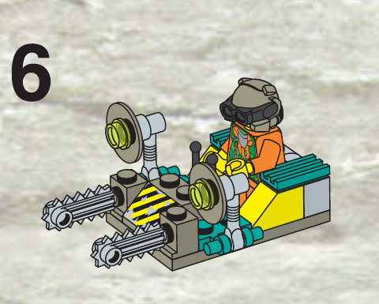

# 03 · Drill Craft — T083 design proposal

**unit.rock_raiders.drill_craft · Small · OFFICIAL-ADAPTED**

**Статус:** `DESIGN_ACCEPTED_T084_AUTHORIZED`; директор прийняв цей target 2026-09-24. Це не модель; T084 залишається незапущеним.

**Production Design Target:** [SOURCE_LOCKED — completed 1277 step 6](drill_craft_target_review.html). The complete direct target and production-facing directions are in [the Design Spec](drill_craft_design_spec.md).

## Завершений вигляд

Завершений 1277: відкрита низька платформа, дві маленькі видовжені пили попереду, центральна смуга небезпеки, Sparks між двома піднятими круглими бічними вузлами. Назва Drill Craft не перетворює набір на машину з одним спіральним буром.

Завершений крок 6 інструкції LEGO 1277, кадрований без зміни source-пікселів. Це саме зовнішній target, не concept art; повні сторінки як Source Evidence відкриваються у [director review](drill_craft_target_review.html).

## Пропорції та масштаб

Один Sparks такого самого розміру, як у Crew. Пили короткі та вузькі, не діаметром із тіло машини. Платформа співмірна з Hover Scout, але ширші підняті боки й дві пили мають одразу відрізняти її; Small не змінюється.

## Конструкція

Вихідні невеликі кріплення передають контактне навантаження на спільну основу. Круглі бічні чашки — окремі джерельні вузли, не ріжучі диски. Видовжені полотна пили зберігають жорсткий каркас; рухаються різальні ланки, а не весь корпус полотна.

## Запропонована адаптація

Пропозиція презентаційного руху: обидві пили опускаються короткою узгодженою дугою й ріжуть паралельно. По периметру полотен рухається спрощена стрічка зубців; за віддаленням лишається напрямлена вібрація/стружка. Бічні чашки залишаються нерухомими та не світяться без функціонального сигналу. Це не змінює геометрію source-цілі.

## Командна позначка

Цей source-locked target не додає командну мітку до моделі. Будь-яка ідентифікація застосовує наявну систему гри окремо, без зміни силуету LEGO-моделі.

## Кольори й матеріали

Жовті бокові скоси, бірюзові решітки, сіра основа й металево-сірі полотна з джерела. Круглі чашки й прозорі вставки не перетворюються на яскраві реактивні двигуни.

## Ракурси

- Спереду: два окремі вузькі ріжучі полотна й проміжок між ними.
- Збоку: пили нижче оператора; круглі бічні вузли підняті на коротких опорах.
- Зверху: дві паралельні пили, центральний щиток і відкрите місце оператора.
- Ззаду: два невеликі кольорові скоси й решітки; не додаємо противагу.

Це словесні вимоги до ракурсів завершеного дизайну, не заявка на наявність нових ортографічних зображень. Підтверджене покриття й прогалини джерел перелічені нижче.

## Стани

| Стан | Видимий результат |
|---|---|
| Спокій / рух | Полотна підняті над поверхнею, ріжучі ланки стоять; дуже низьке зависання в межах наявного наземного руху. |
| Видобуток / контакт | Машина вирівнюється, обидві пили підходять до контакту, ланки рухаються по замкненому периметру; після події результату пилки відходять. |
| Переривання | Відрив від матеріалу до повернення у рух; не залишати активну пилу всередині вже зниклого об’єкта. |
| Пошкодження / знищення | Зупиняється одна різальна стрічка, потім відділяється передній вузол; решта корпусу лишається низькими відкритими санями. |

Усі рухи лише відображають стан симуляції. Немає нових команд, потужності, місткості чи таймінгів. Виробництво, brownout та окремий construction-progress стан не додаються юніту за аналогією з будівлею; поява/ремонт використовують чинні події.

## Геометрія, текстури й віддалення

- Геометрія: two elongated saw bars with a fixed spine and separate moving tooth/chain treatment.
- Геометрія: flat operator sled and hazard panel.
- Геометрія: paired raised round side pods; not cutting discs.

Close: зберігає джерельні головні деталі, кріплення й оператора. Combat: ті самі великі маси й контакти, менше дрібних швів/зубців. Strategic: зберігає форму основи, інструмента та стану; без мікродеталей. Числовий бюджет призначається після прийняття дизайну; перевірка реальною камерою й LOD — T084.

- `rr_tool_wear`: 1024x1024; Linear wear mask, tangent-space normal and roughness variation; no baked highlights. Non-tiling trim/atlas regions aligned to the mechanical wear direction. Normal and fine mask removed at Strategic; Tool material and silhouette remain.
- `rr_hazard_and_service_decals`: 1024x1024; sRGB RGBA decal atlas; alpha is coverage, never shadowing. Atlas placement only; stripes may repeat along authored straight runs without stretching. Keep only broad hazard bands at Combat; remove text and micro-labels at Strategic.

Усі текстури тут SPECIFIED_NOT_AUTHORED. Схвалені M7 матеріали залишаються основою; фотографії джерел і generated-концепти не є ігровими текстурами. Нові маски/декалі — майбутня робота проєкту з окремим оглядом. Не переносити текстурою отвори, опорні вузли або тіні.

## Механіка, точки прив’язки, LOD

[Іменовані опори та точки T082](../../M85SuperScout/Packets/unit_rock_raiders_drill_craft.md#f-state-and-animation-contract) — початкова схема, з такими уточненнями T083:

Pivot_SawFeedLeft/Right lower the rigid bars. Pivot_SawSpinLeft/Right names may remain as reserved driver bindings but drive a tooth-chain treatment, not rigid-bar rotation. Socket_SawContactLeft/Right at the exposed forward cutting zones. Side pods stay fixed.

Existing socket inventory: `Socket_Selection`, `Socket_Health`, `Socket_SawContactLeft`, `Socket_SawContactRight`, `Socket_CutDust`, `Socket_CutSparks`, `Socket_HoverLeft`, `Socket_HoverRight`, `Socket_AudioSaws`, `Socket_AudioHover`. No runtime binding is changed by this document. Exact clearance and animation arcs remain T084/T087 verification, not a request for a pre-model camera gate.

## Підтверджене, адаптоване, невідоме

| Source | Primary evidence | Inventory / archival check | Confidence | Intended use |
|---|---|---|---|---|
| 1277 — Drill Craft / Hovercraft with Ice Saws | [LEGO instructions](https://www.lego.com/en-us/service/building-instructions/1277) no direct official PDF located [archival evidence 1](https://kb.rockraidersunited.com/images/2/2f/1277_Hovercraft_with_Ice_Saws.pdf) | [inventory](https://www.bricklink.com/catalogItemInv.asp?S=1277-1) | CANON_VERIFIED_ARCHIVAL | low open hovercraft construction, two small mirrored ice-saw tools, side lift/engine pods and exposed operator relationship |

### Source audit [RockRaiders:1277]

- Evidence state: `ARCHIVAL_PDF_VISUALLY_AUDITED`
- Evidence links: [Archival scan hosted by Rock Raiders United; the pages themselves carry LEGO branding, set number 1277, product code 4132646 and a 1999 LEGO Group copyright notice, but the PDF is not served from LEGO's current archive. 1](https://kb.rockraidersunited.com/images/2/2f/1277_Hovercraft_with_Ice_Saws.pdf)
- Construction map:
  - Evidence pages 1: Complete flat base, paired yellow side wedges, teal side/rear fittings, central hazard panel and exposed Sparks operator are assembled.
  - Evidence pages 2: Two raised round side hover/engine pods and two forward ice-saw arms attach to the low open craft; the final model is shown from the front-left three-quarter view.
- View/mechanism coverage: front=VERIFIED cover and p2 step 6; rear=PARTIAL p1-2 construction sequence; leftRight=PARTIAL cover and p1-2; top=VERIFIED p1-2 steps 1-6; threeQuarter=VERIFIED cover and p2 final; undersideInterior=PARTIAL p1 bare plate foundation; mechanism=PARTIAL p2 saw and side-pod attachment; no spin, hover or steering sequence
- Verified findings:
  - The complete source is a very low open hovercraft/sled with an exposed operator, not a wheeled miniature drill vehicle.
  - Two forward ice saws are separate mirrored tool arms; the source does not contain one central helical drill.
  - Two raised round side pods and the central hazard panel carry more source identity than any rear bodywork.
- Remaining evidence gaps:
  - The opposite side and strict underside remain unverified.
  - The exact in-game contact pose for both small saws must preserve their mirrored source relationship while keeping excavation feedback readable at Strategic zoom.

Any `PARTIAL` or `MISSING` view remains an explicit gap. One flattering three-quarter image is never sufficient.

**Source-decomposition rule:** A source set is a container of models, figures, equipment and detachable modules, not an automatic one-to-one unit mapping. Any composed design must disclose its exact donor components, adaptation and rejected alternatives before director approval.

- [1277-page01.png](References/1277-page01.png) — [ARCHIVAL_SCAN_OF_OFFICIAL_INSTRUCTIONS](https://kb.rockraidersunited.com/images/2/2f/1277_Hovercraft_with_Ice_Saws.pdf)
- [1277-page02.png](References/1277-page02.png) — [ARCHIVAL_SCAN_OF_OFFICIAL_INSTRUCTIONS](https://kb.rockraidersunited.com/images/2/2f/1277_Hovercraft_with_Ice_Saws.pdf)

**Уточнення джерела в T083:** У T082 текст geometryMustCarry називав saw discs, а Pivot_SawSpin — обертання всього полотна. Завершений крок 6 і вже прийнята референсна картинка показують видовжені пили. T083 уточнює механіку без зміни вихідної силуетної основи чи геймплею.

**Невідоме / межа доказу:** Оригінал не доводить моторизацію ланцюга або функцію бічних чашок. Обраний рух — презентаційна адаптація. Реальні зазори й контактні траєкторії перевіряються лише на моделі T084/T087.

The T082 source packet remains immutable research history; current proposal decisions above supersede only its explicitly identified design/motion suggestions. Source facts not reviewed here retain their stated confidence. No generated image proves hidden attachment geometry.

## Затвердження режисера

Директор затвердив зовнішність завершеного 1277: дві джерельні видовжені пили з окремою стриманою презентацією руху ланок і спокійними бічними чашками. Це прийняття не змінює gameplay чи SimCore. T084 авторизований, але не розпочатий.

**BLOCKING_NOW:** прийняття цього дизайн-кандидата перед його T084. **BLOCKING_LATER:** реальна геометрія, зазори, матеріали, камера/LOD і прив’язка анімації. **DIAGNOSTIC:** порівняння з сусідніми юнітами; не повторювати прийнятий T082 blind review без конкретного дефекту.
