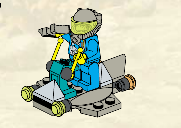
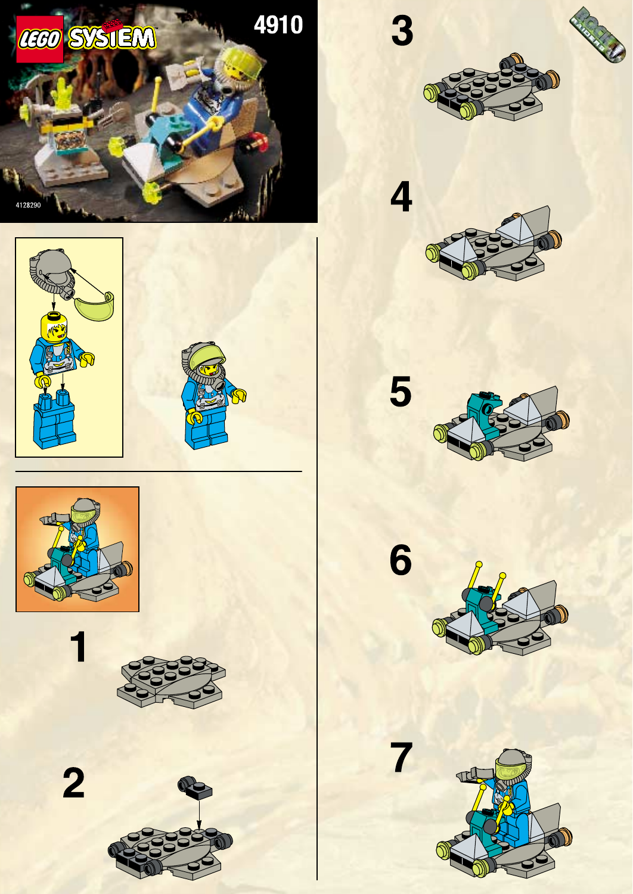

# 02 · Hover Scout — T083 design proposal

**unit.rock_raiders.hover_scout · Small · OFFICIAL-DIRECT**

**Статус:** дизайн прийнято директором 2026-09-24; T084 авторизовано для цього юніта, але не розпочато. Це не модель. T082 прийнято як основу.

## Production Design Target · SOURCE_LOCKED

Завершений Hover Scout 4910 з кроку 7: низька відкрита пластинчаста платформа, синьо-бірюзовий оператор у відкритому місці, велика передня кутова сканерно-інструментальна збірка та окремий задній тримач. Точні форми й кольорові маси відповідають офіційній інструкції; круглі елементи на носі є частинами передніх опор/інструментальної збірки, а не вигаданими датчиками.

Офіційна інструкція LEGO 4910, сторінка 1, зібраний Hover Scout на кроці 7. Лише кадрування джерельного растра; геометрія/колір не перемальовані.

## Source Evidence

Official LEGO/source imagery below defines the original object; generated proposals are not source evidence.

## Пропорції та масштаб

Один оператор стандартного розміру відносно завершеного кроку 7; довжину та ширину машини не змінювати. Візуальне зависання лишається низьким і не створює нового силуетного вузла. Авторитетна наземна площа Small незмінна.

## Конструкція

Зібрати плаский відкритий дек і видимі окремі вузли за кроками 3–7 офіційної інструкції. Передня кутова сканерно-інструментальна збірка, місце оператора та задній тримач лишаються трьома читабельними масами. Окрема станція/п’єдестал набору юнітом не є.

## Запропонована адаптація

Жодної нової зовнішньої геометрії в цільовому ракурсі. Ігрові відмінності: малий зазор наземного зависання; короткий сигнал сканування від наявної передньої збірки без доданої башти чи рухомого сенсора; невелика плоска командна мітка на задній боковій пластині. Не закривати низ новим кожухом і не додавати двигун.

## Командна позначка

Плоскі зовнішні ділянки двох задніх бокових пластин; симетричні маленькі мітки без зміни сірих скосів і бірюзової колонки.

## Кольори й матеріали

Сіра основа, бірюзова колонка, жовті руків’я; прозорі носові елементи зберігають джерельний відтінок. Емісія лише під час позначеного сигналу, не постійне свічення всіх прозорих деталей.

## Ракурси

- Спереду: широка низька платформа; передня кутова сканерно-інструментальна збірка виступає нижче оператора.
- Збоку: відкрите місце й ноги оператора видно над пласким деком; не добудовувати закриті борти чи кабіну.
- Зверху: одна відкрита платформа з передньою збіркою та заднім тримачем, не катамаран.
- Ззаду: зберегти компактний сервісний тримач і розділені пластинчасті маси; низ та протилежний бік лишаються невідомими.

Це словесні вимоги до ракурсів завершеного дизайну, не заявка на наявність нових ортографічних зображень. Підтверджене покриття й прогалини джерел перелічені нижче.

## Стани

| Стан | Видимий результат |
|---|---|
| Спокій / рух | Низьке стримане зависання над рельєфом; без літакового крену й обертання круглих носових деталей. |
| Сканування / наявний імпульс | Наявна передня сканерно-інструментальна збірка коротко позначається сигналом; руки лишаються на керуванні. Візуальний імпульс не додає скан-команди чи нового пострілу. |
| Пошкодження | Коротке порушення рівного зависання і згасання одного сигналу; юніт не змінює швидкість від анімації. |
| Знищення | Корпус опускається, відділяються тримач і мала носова деталь; впізнавані пласкі сани залишаються основною масою. |

Усі рухи лише відображають стан симуляції. Немає нових команд, потужності, місткості чи таймінгів. Виробництво, brownout та окремий construction-progress стан не додаються юніту за аналогією з будівлею; поява/ремонт використовують чинні події.

## Геометрія, текстури й віддалення

- Геометрія: thin deck edge.
- Геометрія: scanner head.
- Геометрія: open operator gap and rear rack.

Close: зберігає джерельні головні деталі, кріплення й оператора. Combat: ті самі великі маси й контакти, менше дрібних швів/зубців. Strategic: зберігає форму основи, інструмента та стану; без мікродеталей. Числовий бюджет призначається після прийняття дизайну; перевірка реальною камерою й LOD — T084.

- `rr_tool_wear`: 1024x1024; Linear wear mask, tangent-space normal and roughness variation; no baked highlights. Non-tiling trim/atlas regions aligned to the mechanical wear direction. Normal and fine mask removed at Strategic; Tool material and silhouette remain.
- `rr_hazard_and_service_decals`: 1024x1024; sRGB RGBA decal atlas; alpha is coverage, never shadowing. Atlas placement only; stripes may repeat along authored straight runs without stretching. Keep only broad hazard bands at Combat; remove text and micro-labels at Strategic.
- `rr_console_and_signal_atlas`: 512x512; sRGB color/alpha plus separate linear emission mask; transparent polymer is not automatically emissive. Non-tiling atlas with stable panel IDs. Replace screens with one bounded Signal or Lamp color block at Strategic.

Усі текстури тут SPECIFIED_NOT_AUTHORED. Схвалені M7 матеріали залишаються основою; фотографії джерел і generated-концепти не є ігровими текстурами. Нові маски/декалі — майбутня робота проєкту з окремим оглядом. Не переносити текстурою отвори, опорні вузли або тіні.

## Механіка, точки прив’язки, LOD

[Іменовані опори та точки T082](../../M85SuperScout/Packets/unit_rock_raiders_hover_scout.md#f-state-and-animation-contract) — початкова схема, з такими уточненнями T083:

Keep Pivot_ScannerYaw and Pivot_ToolPitch at rest; no unsupported moving sensor tower. Socket_SurveyPulse/ScannerVfx sit at the existing forward scanner/tool assembly. Selection stays at ground projection; Health above the operator.

Existing socket inventory: `Socket_Selection`, `Socket_Health`, `Socket_SurveyPulse`, `Socket_ScannerVfx`, `Socket_Lamp`, `Socket_AudioHover`. No runtime binding is changed by this document. Exact clearance and animation arcs remain T084/T087 verification, not a request for a pre-model camera gate.

## Підтверджене, адаптоване, невідоме

| Source | Primary evidence | Inventory / archival check | Confidence | Intended use |
|---|---|---|---|---|
| 4910 — The Hover Scout | [LEGO instructions](https://www.lego.com/en-us/service/building-instructions/4910) [official PDF 1](https://www.lego.com/cdn/product-assets/product.bi.core.pdf/4128290.pdf) | [inventory](https://www.bricklink.com/catalogItemInv.asp?S=4910-1) | PRIMARY_VERIFIED | hover scout construction, palette and equipment |

### Source audit [RockRaiders:4910]

- Evidence state: `OFFICIAL_PDF_VISUALLY_AUDITED`
- Evidence links: [official instruction PDF 1](https://www.lego.com/cdn/product-assets/product.bi.core.pdf/4128290.pdf)
- Construction map:
  - Evidence pages 1: Complete Hover Scout build from flat base plate through open operator deck, front scanner/tool mass and rear equipment.
  - Evidence pages 2: Separate small worksite/scanner station; useful for the Cutter Mast base language, not a reverse view of the Scout.
- View/mechanism coverage: front=PARTIAL p1 cover/final build; rear=PARTIAL p1 final steps; leftRight=PARTIAL p1 construction sequence; top=VERIFIED p1 steps 3-7; threeQuarter=VERIFIED p1 cover and steps; undersideInterior=MISSING; mechanism=PARTIAL p1 scanner/tool mounting; no authored movement sequence
- Verified findings:
  - The Scout is an exposed plate-built sled rather than a closed hovercraft.
  - The operator, scanner/tool and rear rack are independent readable masses.
  - The second-page station provides a source-faithful tripod/pedestal vocabulary for later survey-derived infrastructure.
- Remaining evidence gaps:
  - Acquire explicit underside and opposite-side evidence before final modeling.
  - Any animated scanner sweep is an approved presentation interpretation, not proven by the manual.

Any `PARTIAL` or `MISSING` view remains an explicit gap. One flattering three-quarter image is never sufficient.

**Source-decomposition rule:** A source set is a container of models, figures, equipment and detachable modules, not an automatic one-to-one unit mapping. Any composed design must disclose its exact donor components, adaptation and rejected alternatives before director approval.

- [4910-page01.png](References/4910-page01.png) — [OFFICIAL_INSTRUCTION_PAGE](https://www.lego.com/cdn/product-assets/product.bi.core.pdf/4128290.pdf)

**Невідоме / межа доказу:** Офіційна інструкція не показує строгий низ і протилежний бік; їхню невидиму геометрію не домислювати як hero-масу. Сканерний рух не підтверджений джерелом і не додається в цій цілі. Реальні зазори/опори вирішуються за джерельним силуетом під час T084.

The T082 source packet remains immutable research history; current proposal decisions above supersede only its explicitly identified design/motion suggestions. Source facts not reviewed here retain their stated confidence. No generated image proves hidden attachment geometry.

## Рішення режисера

Директор затвердив через «+» 2026-09-24: офіційний LEGO 4910, крок 7; дозволені лише низький зазор зависання, короткий сигнал від штатної передньої сканерно-інструментальної збірки та мала пласка командна мітка.

**BLOCKING_NOW:** прийняття цього дизайн-кандидата перед його T084. **BLOCKING_LATER:** реальна геометрія, зазори, матеріали, камера/LOD і прив’язка анімації. **DIAGNOSTIC:** порівняння з сусідніми юнітами; не повторювати прийнятий T082 blind review без конкретного дефекту.
