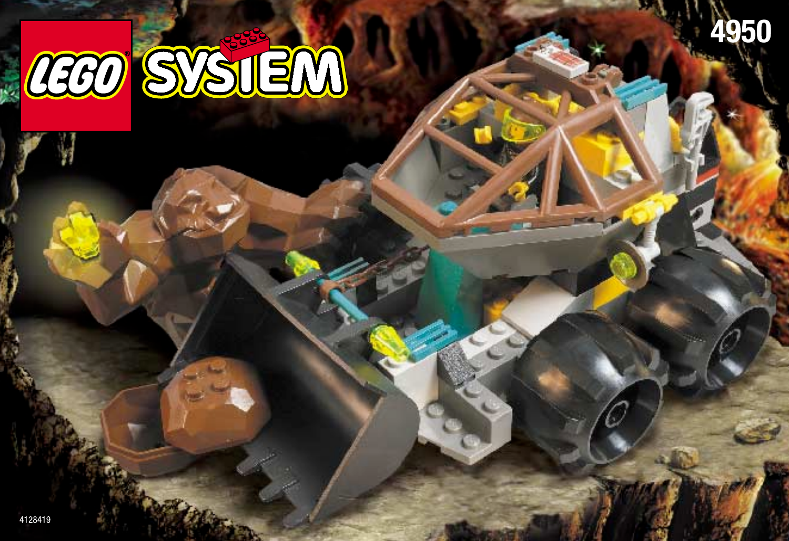
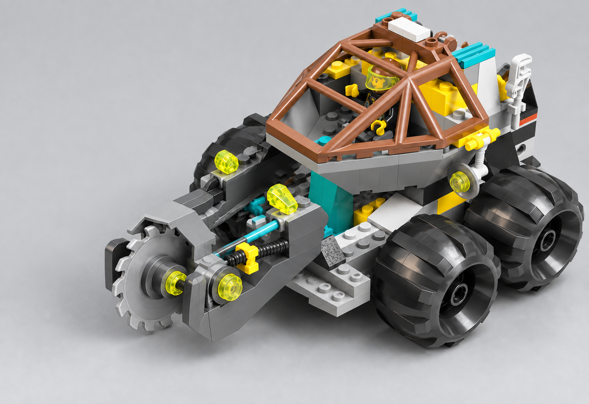

# 05 · Loader Dozer — T083 design proposal

**unit.rock_raiders.loader_dozer · Medium · OFFICIAL-ADAPTED**

**Статус:** завершений дизайн-кандидат для режисерського огляду; не прийнятий дизайн і не модель. T082 прийнято як основу.

## Завершений вигляд

Базовий вигляд — завершений 4950: чотири однакові широкі чорні колеса, низьке сіре шасі, коричневий гранований каркас кабіни, бірюзові вставки й широкий ковш спереду. Після Cutter Package той самий корпус несе один вертикальний різальний диск замість ковша.

Офіційний завершений набір LEGO — джерело зовнішності; не новий ігровий рендер.

НОВА АДАПТАЦІЯ: Cutter Package, завершений концепт v2. Один компактний вертикальний диск. Не офіційний набір і не прийнята модель.

## Пропорції та масштаб

Не збільшувати весь Dozer заради диска. Шина, каркас кабіни й оператор зберігають відношення завершеного 4950. Обидві конфігурації — Medium, один і той самий корінь і точки виділення; винос інструмента не змінює радіус атаки.

## Конструкція

Базові підйомні важелі й нахил ковша відтворюють джерело. Cutter використовує ці дві точки: коротка П-подібна рама охоплює диск і тримає поперечну вісь із двох боків. Задня верхня частина диска захищена простим кожухом, передня/нижня дуга відкрита. Діаметр близько діаметра однієї шини.

## Запропонована адаптація

Єдина нова велика деталь — різальний модуль замість ковша. Один короткий захищений привід і компактна опора, без другої пили чи гармати. Це творча адаптація затвердженого дослідження; офіційний 4950 не має такого комплекту. Новий завершений кольоровий концепт показується окремо від офіційного ковша.

## Командна позначка

По одній маленькій мітці на плоских задніх бокових панелях над колесами; спільні для обох інструментів. Коричневий каркас кабіни не є командною міткою.

## Кольори й матеріали

Велика сіра конструкція, чорні шини, коричневий каркас, бірюзові решітки, жовті функціональні вставки. Сріблястий матеріал тільки на робочій поверхні Cutter; прозорі фари не означають постійної емісії.

## Ракурси

- Спереду: у базі — широкий ковш; у Cutter — один диск між двома опорами. Кабіна й чотири колеса однакові.
- Збоку: короткі важелі ведуть навантаження на шасі; диск не врізається у передню шину.
- Зверху: задня клітка й дві пари коліс; немає танкової башти.
- Ззаду: джерельні прості сервісні площини, без додаткових баків або моторної вежі.

Це словесні вимоги до ракурсів завершеного дизайну, не заявка на наявність нових ортографічних зображень. Підтверджене покриття й прогалини джерел перелічені нижче.

## Стани

| Стан | Видимий результат |
|---|---|
| Ковш / рух | Ковш трохи над землею; колеса котяться, корпус стримано реагує на рельєф. |
| Ковш / контакт | Коротке опускання й подача передньої кромки; без пострілу або стрибка машини. |
| Cutter / рух і контакт | Диск стоїть у спокої; перед контактом опускається весь модуль, диск обертається на власній осі; стружка виникає біля відкритої кромки. |
| Пошкодження / знищення | Один важіль просідає візуально, активний інструмент зупиняється; при загибелі передній модуль падає до розпаду рами. |

Усі рухи лише відображають стан симуляції. Немає нових команд, потужності, місткості чи таймінгів. Виробництво, brownout та окремий construction-progress стан не додаються юніту за аналогією з будівлею; поява/ремонт використовують чинні події.

## Геометрія, текстури й віддалення

- Геометрія: bucket volume and cutting edge.
- Геометрія: side hydraulic linkage.
- Геометрія: four wheel silhouettes.
- Геометрія: optional cutter disc.

Close: зберігає джерельні головні деталі, кріплення й оператора. Combat: ті самі великі маси й контакти, менше дрібних швів/зубців. Strategic: зберігає форму основи, інструмента та стану; без мікродеталей. Числовий бюджет призначається після прийняття дизайну; перевірка реальною камерою й LOD — T084.

- `rr_heavy_frame_surface`: 2048x2048; Tangent-space normal plus linear roughness; body color remains a material parameter. Shared model-space field, 4 m repeat; no per-part phase reset. Half strength at Combat; disabled at Strategic in favor of master-material roughness.
- `rr_tool_wear`: 1024x1024; Linear wear mask, tangent-space normal and roughness variation; no baked highlights. Non-tiling trim/atlas regions aligned to the mechanical wear direction. Normal and fine mask removed at Strategic; Tool material and silhouette remain.
- `rr_hazard_and_service_decals`: 1024x1024; sRGB RGBA decal atlas; alpha is coverage, never shadowing. Atlas placement only; stripes may repeat along authored straight runs without stretching. Keep only broad hazard bands at Combat; remove text and micro-labels at Strategic.
- `rr_console_and_signal_atlas`: 512x512; sRGB color/alpha plus separate linear emission mask; transparent polymer is not automatically emissive. Non-tiling atlas with stable panel IDs. Replace screens with one bounded Signal or Lamp color block at Strategic.

Усі текстури тут SPECIFIED_NOT_AUTHORED. Схвалені M7 матеріали залишаються основою; фотографії джерел і generated-концепти не є ігровими текстурами. Нові маски/декалі — майбутня робота проєкту з окремим оглядом. Не переносити текстурою отвори, опорні вузли або тіні.

## Механіка, точки прив’язки, LOD

[Іменовані опори та точки T082](../../M85SuperScout/Packets/unit_rock_raiders_loader_dozer.md#f-state-and-animation-contract) — початкова схема, з такими уточненнями T083:

Pivot_BucketLift carries the original arm pair in both loadouts. Pivot_BucketTilt carries bucket/yoke pitch. Pivot_CutterSpin at the transverse disc axle. BucketContact/CutterContact follow the respective visible cutting edge, never wheel centre.

Existing socket inventory: `Socket_Selection`, `Socket_Health`, `Socket_BucketContact`, `Socket_CutterContact`, `Socket_ImpactVfx`, `Socket_Lamp`, `Socket_AudioHydraulic`, `Socket_AudioTool`. No runtime binding is changed by this document. Exact clearance and animation arcs remain T084/T087 verification, not a request for a pre-model camera gate.

## Підтверджене, адаптоване, невідоме

| Source | Primary evidence | Inventory / archival check | Confidence | Intended use |
|---|---|---|---|---|
| 4950 — Loader Dozer | [LEGO instructions](https://www.lego.com/en-us/service/building-instructions/4950) [official PDF 1](https://www.lego.com/cdn/product-assets/product.bi.core.pdf/4128419.pdf) | [inventory](https://www.bricklink.com/catalogItemInv.asp?S=4950-1) | PRIMARY_VERIFIED | loader chassis, scoop and defensive derivation |

### Source audit [RockRaiders:4950]

- Evidence state: `OFFICIAL_PDF_VISUALLY_AUDITED`
- Evidence links: [official instruction PDF 1](https://www.lego.com/cdn/product-assets/product.bi.core.pdf/4128419.pdf)
- Construction map:
  - Evidence pages 2-10: Wide low chassis, rear frame, control station and paired structural side rails.
  - Evidence pages 11-20: Full-width bucket, front linkage, high cage, lighting and wheel mounts.
  - Evidence pages 21-22: Explicit bucket lift/tilt play feature and rock-loading pose.
- View/mechanism coverage: front=VERIFIED p1 and p11-22; rear=PARTIAL p17-20; leftRight=VERIFIED p2-22 construction sequence; top=VERIFIED p2-20; threeQuarter=VERIFIED p1 and p21-24; undersideInterior=VERIFIED p2-8 chassis build; mechanism=VERIFIED p21-22 bucket lift/tilt linkage
- Verified findings:
  - The bucket is carried by visible side linkages and must remain the dominant forward mass.
  - Four equal large wheels sit outside a broad plate-built chassis.
  - The operator cage is rear-weighted, leaving the front linkage and bucket visually exposed.
- Remaining evidence gaps:
  - Opposite-side product photography is still desirable for exact hose and control placement.

Any `PARTIAL` or `MISSING` view remains an explicit gap. One flattering three-quarter image is never sufficient.

**Source-decomposition rule:** A source set is a container of models, figures, equipment and detachable modules, not an automatic one-to-one unit mapping. Any composed design must disclose its exact donor components, adaptation and rejected alternatives before director approval.

- [4950-page01.png](References/4950-page01.png) — [OFFICIAL_INSTRUCTION_PAGE](https://www.lego.com/cdn/product-assets/product.bi.core.pdf/4128419.pdf)
- [4950-page21.png](References/4950-page21.png) — [OFFICIAL_INSTRUCTION_PAGE](https://www.lego.com/cdn/product-assets/product.bi.core.pdf/4128419.pdf)
- [4950-page22.png](References/4950-page22.png) — [OFFICIAL_INSTRUCTION_PAGE](https://www.lego.com/cdn/product-assets/product.bi.core.pdf/4128419.pdf)

**Невідоме / межа доказу:** Невидима сторона приводу і точні зазори Cutter потребують моделі. Згенерована ілюстрація не доводить LEGO-з’єднань, не створює виробничого дозволу й не замінює джерело ковша. Задні шланги — просте відкрите дизайнерське продовження, не підтверджена деталь.

The T082 source packet remains immutable research history; current proposal decisions above supersede only its explicitly identified design/motion suggestions. Source facts not reviewed here retain their stated confidence. No generated image proves hidden attachment geometry.

## Рішення режисера

Прийняти або скоригувати завершений Cutter: один компактний вертикальний диск на штатних важелях. Це основне нове рішення зовнішності у першій партії.

**BLOCKING_NOW:** прийняття цього дизайн-кандидата перед його T084. **BLOCKING_LATER:** реальна геометрія, зазори, матеріали, камера/LOD і прив’язка анімації. **DIAGNOSTIC:** порівняння з сусідніми юнітами; не повторювати прийнятий T082 blind review без конкретного дефекту.
