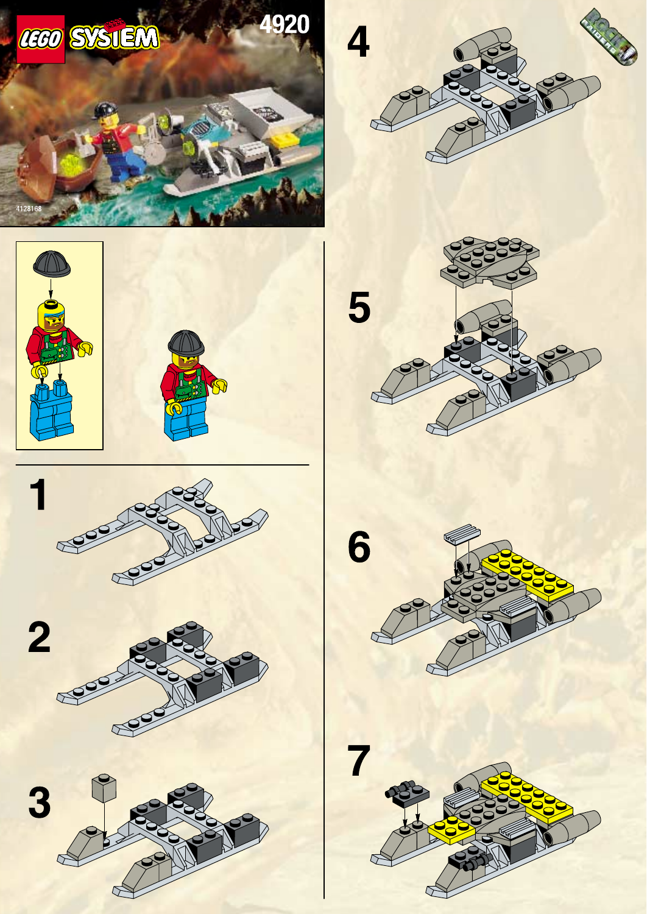

# 04 · Rapid Rider — accepted T083 design package

**unit.rock_raiders.rapid_rider · Small · OFFICIAL-ADAPTED**

**Статус:** дизайн прийнято директором 2026-09-24; T084 авторизовано для цього юніта, але не розпочато. Це не модель. T082 прийнято як основу.

## Production Design Target · SOURCE_LOCKED

Завершений офіційний LEGO 4920 як на цільовому кадрі інструкції: той самий низький двокорпусний скример із відкритою серединою, джерельними силовими вузлами та одним водієм. Зберегти точні відносні пропорції, кольори, деталі та джерельний вантаж; не домальовувати додаткову кабіну або іншу пасажирську геометрію.

Офіційний завершений LEGO Rapid Rider 4920 з одним водієм. Target — точне джерельне зображення з офіційної сторінки інструкції, без перемальовування чи нової геометрії.

## Source Evidence

Official LEGO/source imagery below defines the original object; generated proposals are not source evidence.

Раніша ADAPTED-пропозиція з чотирма Crew відхилена директором і не входить до прийнятого пакета.

## Пропорції та масштаб

Використати пропорції завершеного LEGO 4920 та стандартної мініфігурки як показано офіційним джерелом. Один водій; не зменшувати фігури й не збільшувати транспортний корпус для додаткових пасажирів.

## Конструкція

Зберегти зовнішню конструкцію завершеного LEGO 4920 без видимих змін. Один водій лишається у джерельному місці. Не розтягувати чашу чи полози заради додаткових фігур і не міняти відношення розміру водія до машини.

## Запропонована адаптація

Видимої геометричної чи колірної адаптації в цьому пакеті немає. Додаткового пасажира в чаші та його посадкової пози не затверджувати зараз. Вигляд змінного вантажу також відкласти; у Production Design Target залишається саме офіційна конфігурація набору. Жодні чинні правила місткості чи перевезення не змінюються.

## Командна позначка

Нова зовнішня командна мітка не додається до SOURCE_LOCKED силуету; зберігаються джерельні кольори та маркування.

## Кольори й матеріали

Точно зберегти видимі кольорові маси LEGO 4920 з офіційного target-кадру. Не перефарбовувати корпус у командний колір; прозорі частини не отримують постійного свічення.

## Ракурси

- Цільовий тричвертний ракурс: повторити офіційний завершений вигляд і масштаб мініфігурки до машини.
- Невідомий бік: продовжити лише конструкцію, підтверджену інструкцією; не додавати нові панелі чи вузли.
- Зверху: лишається відкритий простір 4920; нові сидіння чи огорожі не додаються.
- Знизу/ззаду: зберегти лише підтверджену джерелом конструкцію; приховану геометрію не вигадувати.

Це словесні вимоги до ракурсів завершеного дизайну, не заявка на наявність нових ортографічних зображень. Підтверджене покриття й прогалини джерел перелічені нижче.

## Стани

| Стан | Видимий результат |
|---|---|
| Водій / спокій | Один водій у джерельному місці; нерухомий корпус повторює джерельну конфігурацію. |
| Рух | Зовнішність 4920 незмінна; анімація відображає чинний стан руху без обертання цілих корпусів силових циліндрів. |
| Пасажир або альтернативний вантаж | Вигляд додаткового пасажира чи змінного вантажу на цьому етапі не визначається; не створювати для них нову геометрію. |
| Пошкодження / знищення | Застосовуються затверджені спільні стани презентації, зберігаючи читабельність двох полозів; нових бойових вузлів немає. |

Усі рухи лише відображають стан симуляції. Немає нових команд, потужності, місткості чи таймінгів. Виробництво, brownout та окремий construction-progress стан не додаються юніту за аналогією з будівлею; поява/ремонт використовують чинні події.

## Геометрія, текстури й віддалення

- Геометрія: separate long hulls.
- Геометрія: open passenger gap.
- Геометрія: rear propulsion pair.

Close: зберігає джерельні головні деталі, кріплення й оператора. Combat: ті самі великі маси й контакти, менше дрібних швів/зубців. Strategic: зберігає форму основи, інструмента та стану; без мікродеталей. Числовий бюджет призначається після прийняття дизайну; перевірка реальною камерою й LOD — T084.

- `rr_heavy_frame_surface`: 2048x2048; Tangent-space normal plus linear roughness; body color remains a material parameter. Shared model-space field, 4 m repeat; no per-part phase reset. Half strength at Combat; disabled at Strategic in favor of master-material roughness.
- `rr_tool_wear`: 1024x1024; Linear wear mask, tangent-space normal and roughness variation; no baked highlights. Non-tiling trim/atlas regions aligned to the mechanical wear direction. Normal and fine mask removed at Strategic; Tool material and silhouette remain.
- `rr_hazard_and_service_decals`: 1024x1024; sRGB RGBA decal atlas; alpha is coverage, never shadowing. Atlas placement only; stripes may repeat along authored straight runs without stretching. Keep only broad hazard bands at Combat; remove text and micro-labels at Strategic.
- `rr_console_and_signal_atlas`: 512x512; sRGB color/alpha plus separate linear emission mask; transparent polymer is not automatically emissive. Non-tiling atlas with stable panel IDs. Replace screens with one bounded Signal or Lamp color block at Strategic.

Усі текстури тут SPECIFIED_NOT_AUTHORED. Схвалені M7 матеріали залишаються основою; фотографії джерел і generated-концепти не є ігровими текстурами. Нові маски/декалі — майбутня робота проєкту з окремим оглядом. Не переносити текстурою отвори, опорні вузли або тіні.

## Механіка, точки прив’язки, LOD

[Іменовані опори та точки T082](../../M85SuperScout/Packets/unit_rock_raiders_rapid_rider.md#f-state-and-animation-contract) — початкова схема, з такими уточненнями T083:

External propulsion cylinder housings stay fixed; existing Pivot_PropulsionLeft/Right must not rotate those entire shells. No passenger pose, extra seat or alternative cargo presentation is specified in this accepted package; the source target shows one driver. Any later visual occupancy treatment requires a separate presentation decision.

Existing socket inventory: `Socket_Selection`, `Socket_Health`, `Socket_PassengerEntry`, `Socket_PassengerExit`, `Socket_Cargo`, `Socket_PropulsionVfxLeft`, `Socket_PropulsionVfxRight`, `Socket_AudioDrive`. No runtime binding is changed by this document. Exact clearance and animation arcs remain T084/T087 verification, not a request for a pre-model camera gate.

## Підтверджене, адаптоване, невідоме

| Source | Primary evidence | Inventory / archival check | Confidence | Intended use |
|---|---|---|---|---|
| 4920 — Rapid Rider | [LEGO instructions](https://www.lego.com/en-us/service/building-instructions/4920) [official PDF 1](https://www.lego.com/cdn/product-assets/product.bi.core.pdf/4128168.pdf) | [inventory](https://www.bricklink.com/catalogItemInv.asp?S=4920-1) | PRIMARY_VERIFIED | twin-hull transport and propulsion |

### Source audit [RockRaiders:4920]

- Evidence state: `OFFICIAL_PDF_VISUALLY_AUDITED`
- Evidence links: [official instruction PDF 1](https://www.lego.com/cdn/product-assets/product.bi.core.pdf/4128168.pdf)
- Construction map:
  - Evidence pages 1-2: Complete twin-hull Rapid Rider build, central deck, raised canopy/bridge, rear drive equipment and carried rock load.
- View/mechanism coverage: front=PARTIAL p1 cover and p2 final; rear=PARTIAL p2 steps 10-14; leftRight=PARTIAL p1-2 construction sequence; top=VERIFIED p1-2; threeQuarter=VERIFIED p1 cover and p2 final; undersideInterior=PARTIAL p1 steps 1-4 expose hull foundations; mechanism=PARTIAL p2 rear propulsion and cargo placement; no movement sequence
- Verified findings:
  - Two long parallel hulls remain separate around a narrow central deck.
  - The open load/passenger zone is structural negative space and must not be roofed over.
  - Rear propulsion and carried cargo are visually subordinate to the twin-hull plan.
- Remaining evidence gaps:
  - Acquire a clean orthogonal rear view before final propulsion placement.
  - Amphibious hover behavior is canonical adaptation and is not demonstrated by the static manual.

Any `PARTIAL` or `MISSING` view remains an explicit gap. One flattering three-quarter image is never sufficient.

**Source-decomposition rule:** A source set is a container of models, figures, equipment and detachable modules, not an automatic one-to-one unit mapping. Any composed design must disclose its exact donor components, adaptation and rejected alternatives before director approval.

- [4920-page01.png](References/4920-page01.png) — [OFFICIAL_INSTRUCTION_PAGE](https://www.lego.com/cdn/product-assets/product.bi.core.pdf/4128168.pdf)
- [4920-page02.png](References/4920-page02.png) — [OFFICIAL_INSTRUCTION_PAGE](https://www.lego.com/cdn/product-assets/product.bi.core.pdf/4128168.pdf)

**Уточнення джерела в T083:** Раннє формулювання raised canopy/bridge помилкове: джерело показує відкриту вантажну чашу. Чаша лишається джерельною; пасажирську лаву та чотиримісну розкладку відхилено.

**Невідоме / межа доказу:** Інструкція дає обмежене покриття протилежного боку, днища й чистого заднього ракурсу; ці місця не є дозволом вигадувати зовнішні форми. Чи потрібна пізніше окрема видима посадка одного пасажира або заміна його на вантаж — відкладене рішення, не частина цього Production Design Target.

The T082 source packet remains immutable research history; current proposal decisions above supersede only its explicitly identified design/motion suggestions. Source facts not reviewed here retain their stated confidence. No generated image proves hidden attachment geometry.

## Рішення режисера

Директор відхилив ADAPTED-ціль із чотирма Crew та затвердив SOURCE_LOCKED вигляд офіційного LEGO 4920 з одним водієм і джерельними пропорціями. Вигляд додаткового пасажира чи альтернативного вантажу відкладено; місткість гри не змінюється.

**Прийнято директором:** Production Design Target `SOURCE_LOCKED`, офіційний LEGO 4920 з одним водієм. T084 авторизовано, але не розпочато. **BLOCKING_LATER:** виробнича геометрія, матеріали, камера/LOD і прив’язка анімації. **DIAGNOSTIC:** порівняння з сусідніми юнітами; не повторювати прийнятий T082 blind review без конкретного дефекту.
