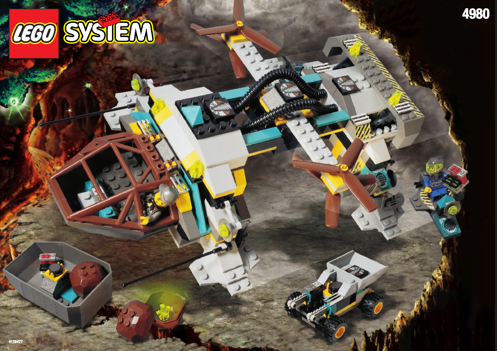
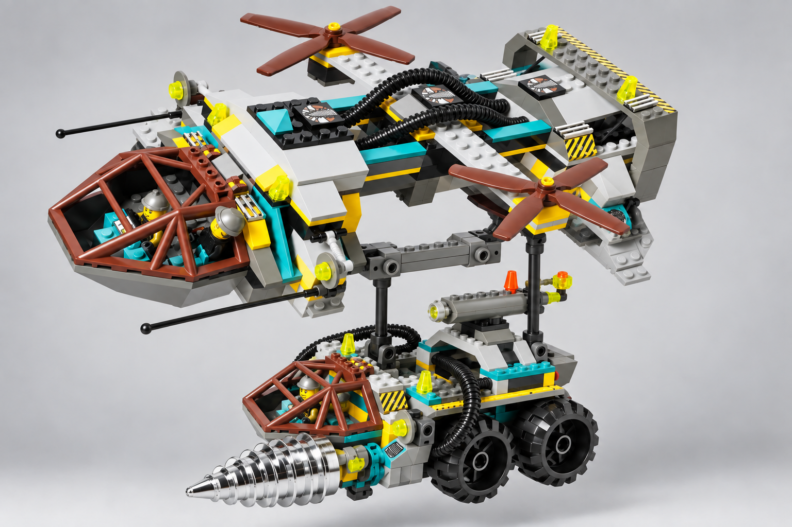

# 08 · Tunnel Transport — T083 accepted design package

**unit.rock_raiders.tunnel_transport · Huge · OFFICIAL-ADAPTED**

**Статус:** DESIGN_ACCEPTED_T084_AUTHORIZED (2026-09-24). Затверджено лише Production Design Target; це не production model. T084 для цього юніта дозволено, але не розпочато.

## Межі повноважень цього пакета

1. **Source Evidence:** незмінені офіційні сторінки LEGO 4980 у `References/` —
   доказ початкової конструкції, не ігровий рендер.
2. **Production Design Target — ADAPTED:**
   `ArtSource/M85/T083/TunnelTransportLoadedV1/loaded-proposal-v2.png` —
   запропонований завершений ігровий вигляд транспортера з Chrome Crusher на
   зовнішньому нижньому підвісі. Це зображення є ціллю адаптації, а не доказом
   офіційного набору. Директор затвердив цю ціль 2026-09-24.
3. **Design Spec:** цей документ нижче визначає, які вузли зберегти з 4980 і
   які видимі зміни ціль v2 пропонує для гри.
4. **NON-AUTHORITATIVE FOR APPEARANCE — technical explanation only:**
   технічний розріз на сторінці
   `tunnel_transport_production_target_review_20260924.html` пояснює шлях
   навантаження, але не замінює цільове зображення й не задає дрібну геометрію.

Ціль v2 навмисно показує лише один ракурс. Видима форма транспортера й
вантажу зрозуміла; дальній верхній шарнір перекритий роторною опорою. Для
виробництва приймається тільки така інтерпретація підвісу: обидва верхні
кріплення стоять під центральною несучою рамою, всередині роторової бази; вони
з’єднані з нижньою поперечною люлькою й не торкаються ротора, його опори чи
лампи. Розріз показує цей шлях умовно, без затвердження розмірів/з’єднувачів.
Зовнішній образ і форма відкритих вузлів мають відповідати цільовому растру.

## Завершений вигляд

Завершений 4980 і прийнятий виправлений референс: довга відкрита несуча рама, дві великі винесені роторні опори, передня гранована кабіна й порожній простір для вантажу. Колісні допоміжні моделі з коробки не стають додатковими юнітами цього транспортера.

Офіційний завершений набір LEGO — джерело зовнішності; не новий ігровий рендер.

НОВА АДАПТАЦІЯ: зовнішній нижній підвіс Chrome Crusher, концепт v2. Загальний завершений вигляд для рішення; верхня дальня точка кріплення накладається на роторну опору в цьому ракурсі. Текст вимагає кріплення до центральної рами; растр не доводить силовий шлях. Додатковий зображений оператор не встановлює ігровий екіпаж.

## Пропорції та масштаб

Оператор спільного масштабу, два джерельні ротори збережені. Huge дозволяє великі виступи рами, але не змінює посадкові правила. Chrome Crusher на підвісі має власний масштаб, не зменшується; зазори з роторними дисками й посадковими опорами — обов’язок T084.

## Конструкція

Роторні балки передають навантаження на спільну раму; під нею — одна центральна поперечина підвісу з парою коротких кріплень. Передня кабіна лишається частиною транспортера. Для великого вантажу підвіс опускає машину нижче рами, а не ховає її в корпусі.

## Запропонована адаптація

Пропозиція: канонічний великий вантаж перевозиться знизу на короткій парній підвісці, з горизонтальним корпусом; бур Chrome Crusher спрямований уздовж польоту. Вихідні ротори не розтягуємо й нових не додаємо. Лише нижній захват/люлька — адаптація для дозволених вантажів, без автоматичного подарунка машин із коробки 4980.

## Окрема пропозиція командної позначки — не включена в ціль

Попередня пропозиція: мала пласка мітка на зовнішній площині рами. Вона не
читається однозначно на завантаженому Production Design Target і тому не є
частиною цієї цілі. Зберігається як окремий нерозглянутий вибір; не додавати
мітку до T084 без окремого погодження. Не забарвлювати лопаті цілком у колір
гравця.

## Кольори й матеріали

Сіра рама, коричневі лопаті та кабіна, бірюзові перемички, жовті небезпечні кромки, чорні гнучкі силові зв’язки. Роторний рух не супроводжується постійним неоновим світінням.

## Ракурси

- Спереду: кабіна нижче поперечної рами, окремі опори зліва й справа.
- Збоку: довжина несучої рами та відкритий підвіс, не закритий фюзеляж.
- Зверху: два чіткі ротори, трубопроводи та великий центральний розрив.
- Знизу/ззаду: відкритий вантажний маршрут; вантаж читається окремим знайомим юнітом.

Це словесні вимоги до ракурсів завершеного дизайну, не заявка на наявність нових ортографічних зображень. Підтверджене покриття й прогалини джерел перелічені нижче.

## Стани

| Стан | Видимий результат |
|---|---|
| Порожній / політ | Ротори крутяться навколо видимих осей із фіксованим нахилом; рама має малий важкий крен, центр відкритий. |
| Завантаження | Стабільне зависання, вирівнювання підвісу над дозволеним вантажем, коротке опускання й фіксація. Анімація не створює нового способу захвату цілей. |
| Політ із вантажем / висадка | Невелике загасаюче хитання, вантаж лишається горизонтальним; при висадці зворотна послідовність за станом симуляції. |
| Пошкодження / знищення | Стримана асиметрична вібрація; роторний вузол відділяється тільки після втрати транспортом функції. Долю вантажу визначають чинні правила. |

Усі рухи лише відображають стан симуляції. Немає нових команд, потужності, місткості чи таймінгів. Виробництво, brownout та окремий construction-progress стан не додаються юніту за аналогією з будівлею; поява/ремонт використовують чинні події.

## Геометрія, текстури й віддалення

- Геометрія: wide crossbeam.
- Геометрія: two rotor discs/pods.
- Геометрія: open cargo cradle.
- Геометрія: visible carried load separation.

Close: зберігає джерельні головні деталі, кріплення й оператора. Combat: ті самі великі маси й контакти, менше дрібних швів/зубців. Strategic: зберігає форму основи, інструмента та стану; без мікродеталей. Числовий бюджет призначається після прийняття дизайну; перевірка реальною камерою й LOD — T084.

- `rr_heavy_frame_surface`: 2048x2048; Tangent-space normal plus linear roughness; body color remains a material parameter. Shared model-space field, 4 m repeat; no per-part phase reset. Half strength at Combat; disabled at Strategic in favor of master-material roughness.
- `rr_tool_wear`: 1024x1024; Linear wear mask, tangent-space normal and roughness variation; no baked highlights. Non-tiling trim/atlas regions aligned to the mechanical wear direction. Normal and fine mask removed at Strategic; Tool material and silhouette remain.
- `rr_hazard_and_service_decals`: 1024x1024; sRGB RGBA decal atlas; alpha is coverage, never shadowing. Atlas placement only; stripes may repeat along authored straight runs without stretching. Keep only broad hazard bands at Combat; remove text and micro-labels at Strategic.
- `rr_console_and_signal_atlas`: 512x512; sRGB color/alpha plus separate linear emission mask; transparent polymer is not automatically emissive. Non-tiling atlas with stable panel IDs. Replace screens with one bounded Signal or Lamp color block at Strategic.

Усі текстури тут SPECIFIED_NOT_AUTHORED. Схвалені M7 матеріали залишаються основою; фотографії джерел і generated-концепти не є ігровими текстурами. Нові маски/декалі — майбутня робота проєкту з окремим оглядом. Не переносити текстурою отвори, опорні вузли або тіні.

## Механіка, точки прив’язки, LOD

[Іменовані опори та точки T082](../../M85SuperScout/Packets/unit_rock_raiders_tunnel_transport.md#f-state-and-animation-contract) — початкова схема, з такими уточненнями T083:

RotorLeft/Right keep source axes and fixed pitch; CargoHoist carries the suspended yoke and CargoSway has a short damped arc. CargoAttach under centre beam; LoadApproach below the open frame. Health above rotor skyline, Selection at ground projection.

Existing socket inventory: `Socket_Selection`, `Socket_Health`, `Socket_CargoAttach`, `Socket_LoadApproach`, `Socket_RotorVfxLeft`, `Socket_RotorVfxRight`, `Socket_Lamp`, `Socket_AudioRotorLeft`, `Socket_AudioRotorRight`. No runtime binding is changed by this document. Exact clearance and animation arcs remain T084/T087 verification, not a request for a pre-model camera gate.

## Підтверджене, адаптоване, невідоме

| Source | Primary evidence | Inventory / archival check | Confidence | Intended use |
|---|---|---|---|---|
| 4980 — Tunnel Transport | [LEGO instructions](https://www.lego.com/en-us/service/building-instructions/4980) [official PDF 1](https://www.lego.com/cdn/product-assets/product.bi.core.pdf/4128427.pdf) | [inventory](https://www.bricklink.com/catalogItemInv.asp?S=4980-1) | PRIMARY_VERIFIED | twin-propeller heavy lift construction |

### Source audit [RockRaiders:4980]

- Evidence state: `OFFICIAL_PDF_VISUALLY_AUDITED`
- Evidence links: [official instruction PDF 1](https://www.lego.com/cdn/product-assets/product.bi.core.pdf/4128427.pdf)
- Construction map:
  - Evidence pages 2-14: Forward cockpit/cargo vehicle module with low worksite chassis and open load bed.
  - Evidence pages 15-20: Separate compact wheeled support module.
  - Evidence pages 21-29: Wide rotor transport frame, twin propeller pods and attachment to the carried modules.
  - Evidence pages 30-32: Cargo container, alternate carried load and final multi-angle product photography.
- View/mechanism coverage: front=VERIFIED p1 and p23-32; rear=VERIFIED p24-32; leftRight=VERIFIED p21-32; top=VERIFIED p21-29; threeQuarter=VERIFIED p1 and p27-32; undersideInterior=VERIFIED p21-29 open transport frame and load connections; mechanism=PARTIAL p21-29 rotors and cargo attachment; no rotor animation sequence
- Verified findings:
  - The aircraft is a skeletal load-bearing bridge with two giant rotor pods, not a conventional enclosed helicopter fuselage.
  - Carried modules remain visibly independent beneath/within the transport frame.
  - The long crossbeam, pod spacing and open central cradle are the primary structural identity.
- Remaining evidence gaps:
  - Rotor pitch and suspension response are not authored by the manual and remain presentation interpretations.

Any `PARTIAL` or `MISSING` view remains an explicit gap. One flattering three-quarter image is never sufficient.

**Source-decomposition rule:** A source set is a container of models, figures, equipment and detachable modules, not an automatic one-to-one unit mapping. Any composed design must disclose its exact donor components, adaptation and rejected alternatives before director approval.

- [4980-page01.png](References/4980-page01.png) — [OFFICIAL_INSTRUCTION_PAGE](https://www.lego.com/cdn/product-assets/product.bi.core.pdf/4128427.pdf)
- [4980-page29.png](References/4980-page29.png) — [OFFICIAL_INSTRUCTION_PAGE](https://www.lego.com/cdn/product-assets/product.bi.core.pdf/4128427.pdf)
- [4980-page30.png](References/4980-page30.png) — [OFFICIAL_INSTRUCTION_PAGE](https://www.lego.com/cdn/product-assets/product.bi.core.pdf/4128427.pdf)
- [4980-page31.png](References/4980-page31.png) — [OFFICIAL_INSTRUCTION_PAGE](https://www.lego.com/cdn/product-assets/product.bi.core.pdf/4128427.pdf)
- [4980-page32.png](References/4980-page32.png) — [OFFICIAL_INSTRUCTION_PAGE](https://www.lego.com/cdn/product-assets/product.bi.core.pdf/4128427.pdf)

**Невідоме / межа доказу:** Завершений концепт v2 показує загальний вигляд із Chrome Crusher знизу. Дальня верхня точка підвісу у растрі накладається на роторну опору: він не доводить її кріплення до центральної рами. Текстова вимога — навантаження лише через центральну раму й боки шасі вантажу; не через ротор або верхню лампу. Додатковий намальований оператор не є затвердженим екіпажем. Точний масштаб, зазори й приховані з’єднання — T084, без нового растра як підміни доказу.

The T082 source packet remains immutable research history; accepted design decisions above supersede only its explicitly identified design/motion suggestions. Source facts not reviewed here retain their stated confidence. No generated image proves hidden attachment geometry.

## Рішення режисера

**Затверджено 2026-09-24:** ADAPTED-ціль із зовнішнім нижнім підвісом одного окремого Chrome Crusher, на горизонтальному положенні, і парою підвісок, з’єднаних лише з центральною несучою рамою. Окрема пропозиція командної мітки не входить до цієї цілі.

**BLOCKING_LATER:** реальна геометрія, зазори, матеріали, камера/LOD і прив’язка анімації — перевірки T084/T087. **DIAGNOSTIC:** порівняння з сусідніми юнітами; прийнятий T082 blind review не повторювати без конкретного дефекту. T084 дозволено лише для Tunnel Transport і ще не розпочато.
